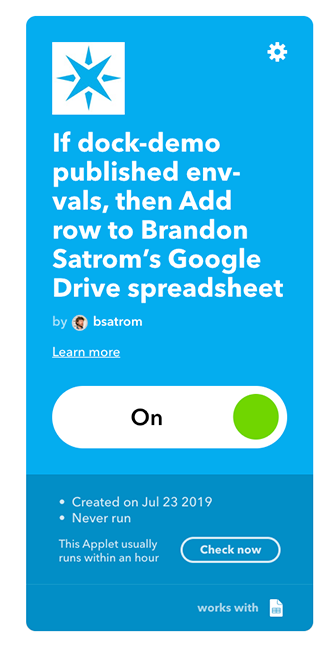

# Chapter 3: Using Particle Webhooks with IFTTT & azure IoT Central

| **Project Goal**            | Use Particle Webhooks and Integrations to connect your app to IFTTT and Azure IoT Central.                                                                                        |
| --------------------------- | ------------------------------------------------------------------------------------------------------------------------------------------------------------------------- |
| **What you’ll learn**       | Working with Particle Integrations, IFTTT, and Azure IoT Central |
| **Tools you’ll need**       | Particle Workbench, an [IFTTT.com](https://ifttt.com) account, an [Azure account](https://portal.azure.com), a Particle Argon, and the Grove Starter Kit for Particle Mesh.                                                                                                            |
| **Time needed to complete** | 60 minutes                                                                                                                                                                |

In this session, you're going to explore the power of Particle integrations, first with the popular IF This Then That (IFTTT) service, then with Azure IoT Central. If you get stuck at any point during this session, [click here for the completed, working source](https://go.particle.io/shared_apps/5d40aec2279e1e000b9ad57b).

## Exploring the Particle CLI and Cloud API

### The Particle CLI

1.  If you haven't already, [install the Particle CLI](https://docs.particle.io/guide/tools-and-features/cli/photon/). Open a terminal window and type the following command:

```bash
bash <( curl -sL https://particle.io/install-cli )
```

2.  Type `particle login` and enter your Particle account email and password when prompted.


3.  Once you're logged in, type `particle list` to see your list of online devices.


4.  The device you've been using for this workshop has two variables and one function. Get the value of the `temp` variable with the command `particle get temp`.


5.  You can also call one of the two functions to light up the yellow or blue LED button. Type the command `particle call <your-device-name> toggleLed` in the terminal. Run the same command again to turn the light off.

### The Particle Device Cloud API

Behind the scenes, every interface that Particle provides to work with devices, from the Console, to mobile apps, SDKs, and the CLI, they all talk through a RESTful Device Cloud API. You can even call yourself, directly.

_The next few steps assume you have cURL installed on your machine. If you don't have this command-line utility on your machine, you can download and install it [here](https://curl.haxx.se/download.html) or use a GUI-based tool like [Postman](https://www.getpostman.com/)._

1.  First, you'll need to obtain an access token from the CLI. Type `particle token list` to view the tokens associated with your account. The first one listed is your `user` token, and can be used to access the Device Cloud API. If no tokens are listed, generate a new one with `particle token new`.

2.  With your token and Device ID in hand, type the following cURL command into a terminal window, replacing the text below in `< >` with your information.

```bash
curl https://api.particle.io/v1/devices?access_token=<your token>
```

By default, the response will generate a wall of text in your terminal. If you have Python 2.6+ installed on your machine, you can pipe the output to the `json.tool` and get pretty-printed JSON.

```bash
curl https://api.particle.io/v1/devices\?access_token\=<your token>
| python -m json.tool
```


3.  For this next command, you need the Device ID of the Photon attached to your badge. You can find that in the console or via the `particle list` CLI command.

4.  Let's call the `toggleLed` function using the Device Cloud API. Type the following, again replacing the text below in `< >` with your information.

```bash
curl https://api.particle.io/v1/devices/<device id>/toggleB \
     -d access_token=<your token>
```


You've now explored a number of ways that you can interface with the Particle Device cloud and your connected devices! Now, let's go beyond the Particle ecosystem and explore some of the ways that you can integrate with other 3rd party services, and backhaul your data into other cloud services.


## Introducing the Particle Integrations and IFTTT

### Setting up an IFTTT Integration

IFTTT (If This, Then That) is a web-based service that allows you to create integrations via simple conditional statements, called applets. There are hundreds of pre-built services you can leverage, and first-class support for Particle devices. In this section, you're going to create an IFTTT integration that posts a tweet when you press a button on your badge.

**Note**: During the flow below, you'll need to connect both your Particle and Google accounts with IFTTT. When prompted, follow the on-screen instructions to do so.

1.  Start by heading over to [IFTTT](https://ifttt.com) and either login, or create a new account.


2.  After logging in, click "New Applet" in the top right of your dashboard.


3.  Click the "+this" button.


4.  In the "Search services" input, type "particle" and click on the Particle card.


5.  Click on the "New event published" card.


6. In the trigger fields, set the event name as `env-vals`, leave the Event Content field blank and set the Device name to the name of your device. Click "create trigger."


7. You've set-up the trigger on the Particle end, now its time for the **That**+ portion of the setup. Click the "+that" button.


8. In the action fields, set the spreadsheet name to "TCEnvVals." Leave the defaults in the other fields and click "Create action."


9. Click the "Finish" button to create your applet.




Now, let's modify our device firmware to publish temp and humidity values.

### Refactoring out the blocking delay

First, let's refactor our firmware to remove the `delay` in the loop. While the delay approach is common when getting started with creating embedded applications, it's a blocking operation. This means that any calls you make to the device during a delay may timeout before being received.

One common way to write periodic code without using `delay` is to use the built-in `millis()` function and keep track of the elapsed time between the last time you performed an operation (like a temp check) and the wait time between operations.

1. First, let's add some global variables to hold the last check time and an interval. Add the following to the top of your project, outside of the `setup` and `loop`.

```cpp
unsigned long previousCheckMillis = 0;
unsigned long checkInterval = 5000;
```

2. Now, in the `loop`, add a local variable to hold the current time elapsed. The `millis()` function returns the number of milliseconds that have elapsed since your device began running the current program. 

```cpp
unsigned long currentMillis = millis();
```

3. Next, remove the `delay` at the end of your loop function. Then, wrap the rest of the code with an if statement to see if the `checkInterval` time has elapsed.

Make sure you also update the `previousCheckMillis` variable to the current `millis` time or this `if` statement will never evaluate to `true` after the first time it runs.

```cpp
if (currentMillis - previousCheckMillis > checkInterval) { 
  previousCheckMillis = millis();

  /* rest of Loop code here */ 
}
```

Your `loop` should now look like this:

```cpp
void loop()
{
  unsigned long currentMillis = millis();

  if (currentMillis - previousCheckMillis > checkInterval)
  {
    previousCheckMillis = millis();

    temp = (int)dht.getTempFarenheit();
    humidity = (int)dht.getHumidity();

    Serial.printlnf("Temp: %f", temp);
    Serial.printlnf("Humidity: %f", humidity);

    double lightAnalogVal = analogRead(A0);
    currentLightLevel = map(lightAnalogVal, 0.0, 4095.0, 0.0, 100.0);

    if (currentLightLevel > 50)
    {
      Particle.publish("light-meter/level", String(currentLightLevel), PRIVATE);
    }
  }
}
```
### Publishing a payload with temp and humidity values

Now, let's send the current temp, humidity and light level using a `Particle.publish` event. You'll sind a single event with all three values in a single JSON object. To do this, you'll use the `JSONParserGenerator` library.

1. Open the Workbench Command Palette (CMD+SHIFT+P or CTRL+SHIFT+P) and select the "Particle: Install Library" option.

2. In the text box, type "JsonParserGeneratorRK" and click enter.

3. At the top of your project, add an include statement:

```cpp
#include "JsonParserGeneratorRK.h"
```

4. Add a new function to your app called `createEventPayload` that takes the temp, humidity and light readings. This function will create an instance of `JsonWriterStatic` and `JsonWriterAutoObject` objects, insert key-value pairs for each reading, and then get the JSON object as a string buffer that you can send along in a `Particle.publish()` event.

```cpp
void createEventPayload(int temp, int humidity, double light)
{
  JsonWriterStatic<256> jw;
  {
    JsonWriterAutoObject obj(&jw);

    jw.insertKeyValue("temp", temp);
    jw.insertKeyValue("humidity", humidity);
    jw.insertKeyValue("light", light);
  }
}
```

5. Now, let's publish a new event, and call the `createEventPayload` function to provide a formatted JSON string for the data parameter. Add the following to the end of your `createEventPayload` function.

```cpp
Particle.publish("env-vals", createEventPayload(temp, humidity, currentLightLevel), PRIVATE);
```

### Posting sensor values to Google Sheets

1. Flash this firmware to your device and navigate to the Particle console. Every few seconds, you'll see a new `env-vals` event show up.


2. Open Google Drive and look for a folder named "events." In that folder, you'll find a Sheet called "TCEnvVals." Open it, and you'll see a row for each event published by your device:


Now that you have data streaming into Google Sheets, let's transform the data and create some simple visualizations!

### Processing data in Google Sheets

Before you create data visualizations with our sensor data, you need to transform the sensor values into discrete values. You'll do this by creating a simple script that processes the raw data as it is added to the main sheet, inserting each raw sensor value in a new sheet for data viz.

1. In the "TCEnvVals" document, create a new sheet called "Processed" and give it four columns, "Temp," "Humidity," "Light" and "Time."

2. In the Tools menu, click the "Script Editor" option, which will open a new tab with the Google Apps Script editor.

3. Click on the "Untitled project" text and give the project a name, like "ProcessTCSensorData."

4. Remove the default function code and add an `onChange` event with the following code.

```js
function onChange(e) {
  var row = SpreadsheetApp.getActiveSheet().getLastRow();
  
  var envVals = SpreadsheetApp.getActiveSheet().getRange("B" + row).getValue();
  var time = SpreadsheetApp.getActiveSheet().getRange("D" + row).getValue();
  
  var envObj = JSON.parse(envVals);
  
  if (envObj.temp != '0') {
    var ss = SpreadsheetApp.getActiveSpreadsheet();
    var processedSheet = ss.getSheetByName('Processed');
    processedSheet.appendRow([envObj.temp, envObj.humidity, envObj.light, time]);
  }
}
```

The code above is a JavaScript function that uses the Google Sheets API to get the last row inserted into the main sheet, extract the sensor vals, and the timestamp. The sensor vals are parsed into a JSON object, and then you add a new row to the "Processed" sheet with those values and the timestamp.

5. Save the file.

6. Now, you'll need to add a change trigger to this app. Click the clock icon to open the triggers for this project.


7. Click "Add Trigger" at the bottom left.


8. In the trigger window that opens, make sure that `onChange` is selected as the function name, and "On change" is selected as the event type.


9. Click save to create the trigger. You'll be asked to sign-in with your Google Account and grant access to your app. Follow the on-screen instructions to do so.


10. In the tab for your spreadsheet, select the "Processed" sheet. After a few moments, records should start coming through. 


If you're not seeing anything after a bit, you can click the "Check now" button in your IFTTT Applet.


### Vizualizing data with Google Sheets

Once you have some processed data, you can add a chart to your sheet!

1. Create a new tab called "DataViz"

2. Click the "Insert" menu and select "Chart."


3. The Chart menu will open on the right side of the window. In the "Chart type" dropdown, select the combination chart type.


4. Click the X-Axis box to open the "Select a data range" window. Navigate to the "Processed" sheet and select the top of the Time tab.


5. Click "Add Series" to open the "Select a data range" window.


6. Repeat the same process to add Series data for the "Humidity" and "Light" columns.


7. Now let's customize. In the Chart editor, click the "Customize" tab and expand the "Series" item. Select the "Temp" series. Then, change the type to "Line."


8. Now select the "Light" series and change the type to "Columns."


9. Close the chart editor. If everything has been configured properly, you'll see a chart that looks like this.


And that's how you do DataViz with Google Sheets and IFTTT. Now let's explore integrating with Azure IoT Central.

## Integrating with Azure IoT Central

IFTTT is a great tool for intrgrating with a variety of 3rd party tools, but sometimes you need to backhaul your data to a cloud provider for additional processing or routing. Thankfully, Particle Integrations make this easy. 

In this section, you'll explore Azure IoT Central, ingest data, and add simple visualizations. First, you'll need to set-up an IoT Hub instance.

### Setting up Azure IoT Central

1.  Sign up for an [Azure Account](https://azure.microsoft.com/en-us/get-started/), or sign in if you already have one.


2.  In the dashboard, click "Create a resource." Then click "Internet of Things," and "IoT Central Application" at the top of the list.


3. Give the IoT Central Application an name and URL (both must be globally unique). Then, select a subscription, select or create a resource group, choose a pricing tier, "Custom application" for the template, and East US for the location. Finally, click "Create" and wait for the deployment to complete.


4. When the deployment completes, click the "Go to resource" button in the notification window.

5. Click the URL for your IoT Central Application to open it in a new tab.

### Adding Device Telemetry and Commands

6. Click the "Create Device Templates" card on the home page. Click "Custom" in the next screen.


7. Name the template "Particle Argon" and click "Create."


8. Click the "New" menu option and select "Telemetry."


9. Fill in the telemetry options using the data below and click "Save."

| Display Name | Field Name | Units | Minimum Value | Maximum Value | Decimal Places |
| ------------ | ------------ | ------------ | ------------ | ------------ | ------------ | 
| Temperature | temp | degF | 0 | 110 | 0 |


10. Repeat steps 8-9 for humidity and light, using the values below.

| Display Name | Field Name | Units | Minimum Value | Maximum Value | Decimal Places |
| ------------ | ------------ | ------------ | ------------ | ------------ | ------------ | 
| Humidity | humidity | % | 0 | 100 | 0 |
| Light Level | light | % | 0 | 100 | 2 |

Once done, you'll start to see simulated data show up on the right side of the screen.


11. Click the "Commands" menu item, then click the "New Command" button.


12. In the "Configure Command" section, enter "Read Sensor Vals" for the "Display Name," and "readSensors" for the "Field Name." Then, click save.


13. Add another command with the name "Toggle LED" and "toggleLed" for the "Field Name."

### Create a Real Device in IoT Central

14. Click the Device Explorer sidebar menu. Then, click the "+" button and select "Real" to create a real device. This is an IoT Central representation of your physical Argon.


15. Click "Create."


16. Click the "Connect" menu item at the top right.


17. Copy the "Primary Key" and "Device ID" from the popup window. You'll need these for the next step.


18. Before moving on, you'll need to create a connection string to use in our firmware to connect to Azure IoT Central. To do this, you have two options: 1) The [Azure Keygen Utility](https://github.com/Azure/dps-keygen), which must be installed locally, or 2) this [Web-based tool](https://github.com/Azure/dps-keygen) from Azure Dev Advocate Dave Glover. The latter is not recommended for production instances, but is fine for this lab.


Now, let's update our firmware to integrate with Azure IoT Central!

### Using the Azure IoT Central Device Bridge Library

First, you'll need to install a library to work with Azure IoT Central.

1. Open the Workbench command palette and select the "Particle: Install Library" option.

2. Enter "AzureIotHubClient" for the library name.

3. Once the library is installed, add an include to the top of your project.

```cpp
#include "AzureIotHubClient.h"
```

4. Just below the include, add another line for the connection string. Replace the text in quotes with the string you generated in the last section.

```cpp
#define AZURE_CONNECTON_STRING "<Your Azure IoT Hub or Azure IoT Central Connection String>"
```

5. Next, create a callback method for Azure IoT to use when you call a command from IoT Central, and initialize the Hub object. The second parameter is for a Cloud2Device messages, which you're not using here, so you just set it to `NULL`.

```cpp
int callbackDirectMethod(char *method, byte *payload, unsigned int length);

IotHub hub(AZURE_CONNECTON_STRING, NULL, callbackDirectMethod);
```

6. One of the commands you set-up in IoT Central was `readSensors`, which you don't have yet, so let's create it. This just uses the same code in the `loop`, which you could refactor into this function, or leave as-is if you want.

```cpp
void readSensors()
{
  temp = (int)dht.getTempFarenheit();
  humidity = (int)dht.getHumidity();

  double lightAnalogVal = analogRead(A0);
  currentLightLevel = map(lightAnalogVal, 0.0, 4095.0, 0.0, 100.0);

  createEventPayload(temp, humidity, currentLightLevel);
}
```

7. Now, let's define the `callbackDirectMethod` function. You set-up two methods in IoT Central, named `readSensors` and `toggleLed` (which is also the name of our `Particle.function` from the last lab). Azure IoT passes the method name in as a string, so you can determine which method is called using the `strcmp` C function, which returns `0` if the strings match. If you get a match, you'll publish a debug message to the Particle Device Cloud and then call the appropriate function. Finally, you'll return a 200 HTTP Status Code, or a 400 if the method string doesn't match what you expect.

```cpp
int callbackDirectMethod(char *method, byte *payload, unsigned int payloadLength)
{
  if (strcmp(method, "readSensors") == 0)
  {
    Particle.publish("iot-central/debug", "Read Sensors from IoT Central!", PRIVATE);
    readSensors();
  }
  else if (strcmp(method, "toggleLed") == 0)
  {
    Particle.publish("iot-central/debug", "Toggle LED from IoT Central!", PRIVATE);
    toggleLed("");
  }
  else
  {
    return 400;
  }

  return 200;
}
```

8. Now, let's modify the firmware to send telemetry data to Azure IoT Central. You'll need to modify the `createEventPayload` method to publish an event to Azure IoT, in addition to the Particle Device Cloud. The `hub.loop()` method checks to make sure you're connected to Azure IoT and, if so, it adds the Azure Device ID to the payload and sends a debug message to the Particle Device Cloud. Finally, `hub.publish()` sends the payload with our telemetry data to Azure IoT.

```cpp{11-17,20-23}
void createEventPayload(int temp, int humidity, double light)
{
  JsonWriterStatic<256> jw;
  {
    JsonWriterAutoObject obj(&jw);

    jw.insertKeyValue("temp", temp);
    jw.insertKeyValue("humidity", humidity);
    jw.insertKeyValue("light", light);
    
    if (hub.loop())
    {
      Particle.publish("iot-central/debug", "Sending Env Vals", PRIVATE);
      jw.insertKeyValue("deviceid", hub.getDeviceId());
    } else {
      Particle.publish("iot-central/debug", "IoT Hub Not Connected!", PRIVATE);
    }
  }

  if (hub.loop())
  {
     hub.publish(jw.getBuffer());
  }

  Particle.publish("env-vals", jw.getBuffer(), PRIVATE);
}
```

9. Flash your device and, once it comes online, you should see your Azure IoT debug messages in the Particle Console.


10. Navigate back to your Azure IoT Central application and click the "Devices" menu item. Click on your real device (not the simulated device) and you'll be taken to the telemetry dashboard, which will provide a live view of incoming data from your device.


11. Now, click the "Commands" menu item for your device, which should show the two commands you set-up in the device template. Click "Run" on the "Toggle LED" command.


12. After the command completes, the LED on your device should light up, and you'll see a debug message in the Particle Console.


Now that everything is configured and you're streaming sensor data into Azure IoT Central, let's build some more visualizations.

### Building Visualizations in IoT Central

To build dashboard visualizations for our Particle Device, you'll need to edit the device template. 

1. Click on the "Device Templates" menu item in IoT Central and click on your "Particle Argon" template.


2. Click the "Dashboard" menu item.


3. Click the "Last Known Value" widget. In the configuration window, set the title to "Last Temp," the measurement type to "Telemetry" and, in "Measures", click the visibility icon next to "Temperature" to select it.


4. Click save, and the widget will show up in the main panel, with simulated data.


5. Repeat steps 3 and 4 for the humidity and light sensor values.


6. Now, click the "Line Chart" widget. In the configuration window, enter "Env Vals" as the title, set a time range to the past hour, and click the visibility icon for all three values to select them.


7. Click save and the chart will be created, again with simulated data.


8. Click on the "Devices" left menu item, and select your real device. Click the "Dashboard" top menu item and you'll see the real values from your Particle Argon.


<hr/>

**Congratulations! You've completed this workshop. Now you're a Particle Master! Take a moment to pat yourself on the back and bask in your newfound IoT-commandery. And if you want to take your exploration further, click the "Extra" link below!**


**BEFORE YOU GO** you'd love it if you could provide feedback on this workshop. Please visit [this link](https://particleiot.typeform.com/to/JiF8xM) to rate your experience.
